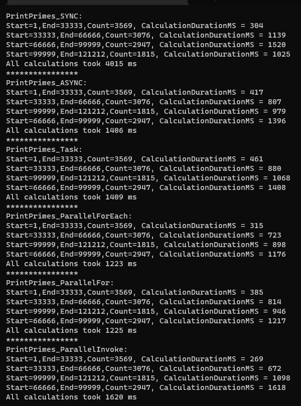

# Print primes sync vs async report
https://he.wikipedia.org/wiki/%D7%9E%D7%A1%D7%A4%D7%A8_%D7%A8%D7%90%D7%A9%D7%95%D7%A0%D7%99
* Create application that compares run time of Sync methods vs ASync methods prime numbers in a range 
* Create ASync methods using Task,Paraller.For,Paraller.ForEach,Paraller.Invoke,async await.
* Demo output
<pre>
PrintPrimes_SYNC:
Start=1,End=33333,Count=3569, CalculationDurationMS = 304
Start=33333,End=66666,Count=3076, CalculationDurationMS = 1139
Start=66666,End=99999,Count=2947, CalculationDurationMS = 1520
Start=99999,End=121212,Count=1815, CalculationDurationMS = 1025
All calculations took 4015 ms
****************
PrintPrimes_ASYNC:
Start=1,End=33333,Count=3569, CalculationDurationMS = 417
Start=33333,End=66666,Count=3076, CalculationDurationMS = 807
Start=99999,End=121212,Count=1815, CalculationDurationMS = 979
Start=66666,End=99999,Count=2947, CalculationDurationMS = 1396
All calculations took 1406 ms
****************
PrintPrimes_Task:
Start=1,End=33333,Count=3569, CalculationDurationMS = 461
Start=33333,End=66666,Count=3076, CalculationDurationMS = 880
Start=99999,End=121212,Count=1815, CalculationDurationMS = 1068
Start=66666,End=99999,Count=2947, CalculationDurationMS = 1408
All calculations took 1409 ms
****************
PrintPrimes_ParallelForEach:
Start=1,End=33333,Count=3569, CalculationDurationMS = 315
Start=33333,End=66666,Count=3076, CalculationDurationMS = 723
Start=99999,End=121212,Count=1815, CalculationDurationMS = 898
Start=66666,End=99999,Count=2947, CalculationDurationMS = 1176
All calculations took 1223 ms
****************
PrintPrimes_ParallelFor:
Start=1,End=33333,Count=3569, CalculationDurationMS = 385
Start=33333,End=66666,Count=3076, CalculationDurationMS = 814
Start=99999,End=121212,Count=1815, CalculationDurationMS = 946
Start=66666,End=99999,Count=2947, CalculationDurationMS = 1217
All calculations took 1225 ms
****************
PrintPrimes_ParallelInvoke:
Start=1,End=33333,Count=3569, CalculationDurationMS = 269
Start=33333,End=66666,Count=3076, CalculationDurationMS = 672
Start=99999,End=121212,Count=1815, CalculationDurationMS = 1098
Start=66666,End=99999,Count=2947, CalculationDurationMS = 1618
All calculations took 1620 ms
</pre>

