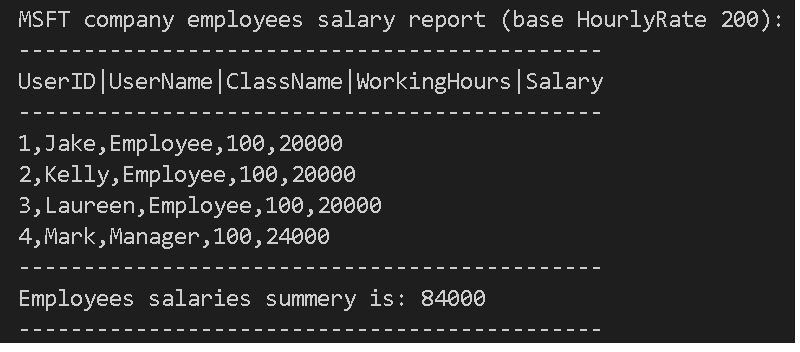

<header>
<strong>
Polimorphism practice - Company employees salaries report
</strong>
</header>

Create a payrol application that enable to create a company with their employees data and outputs a detailed report for each of them and a salaries summery.
 
<strong>
Use the following logic to create the needed classes :
</strong>
<ul>
<li>
Each user has a user name , role name[User||Employee||Manager], unique readonly numeric user ID.
</li>
<li>
Company has name and hourly rate
</li>
<li>
Employee salary is hourly rate* working hours.
</li>
<li>
Manager salary is employee salary * 1.2.
</li>
</ul>
<strong>
Use the following code to generate the salaries report:
</strong>

<code>
Company msft = new Company(){ Name = "MSFT", HourlyRate = 200 };
 
msft.Employees = new Employee[]{
 
new Employee("Jake",100),
 
new Employee("Kelly",100),
 
new Employee("Laureen",100),
 
new Manager("Mark",100)
 
};    
 
Console.Clear();
 
msft.PrintSalaries();
</code>

<strong>
The output should be like this:
</strong>
 

