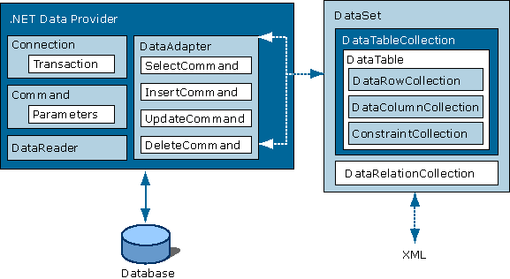
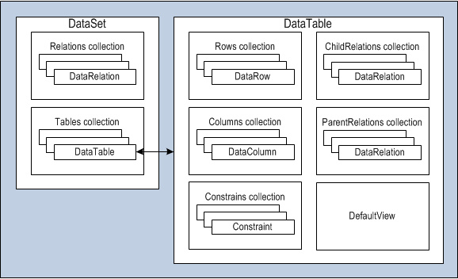

# ADO.NET technology , main classes

1. ADO.NET - ADO.NET is a set of classes that expose data access services for .NET Framework programmers. ADO.NET provides a rich set of components for creating distributed, data-sharing applications. It is an integral part of the .NET Framework, providing access to relational, XML, and application data.

- https://learn.microsoft.com/en-us/dotnet/framework/data/adonet/
- https://dotnettutorials.net/course/ado-net-tutorial-for-beginners-and-professionals/

----------

2. DataSet is a in-memory representation of a collection of data from one or more databases. It can contain multiple DataTable objects, each of which represents a table of data. A DataTable is a collection of DataRow objects, which represent a single row of data in the table. Each DataRow contains a collection of DataColumn objects, which represent a single column of data in the row..
3. DataTable: Represents a table of in-memory data.
4. DataColumn: Represents a column of a DataTable, with a name and data type.
5. DataRow: Represents a row of data in a DataTable.

----------

6. SqlConnection - a connection to a SQL Server database https://learn.microsoft.com/en-us/dotnet/api/system.data.sqlclient.sqlconnection
7. SqlCommand - represents a Transact-SQL statement or stored procedure to execute against a SQL Server database https://learn.microsoft.com/en-us/dotnet/api/system.data.sqlclient.sqlcommand
8. SqlDataReader - Provides a way of reading a forward-only stream of rows from a SQL Server database https://learn.microsoft.com/en-us/dotnet/api/system.data.sqlclient.sqldatareader
9. TransactionScope - Makes a code block transactional https://learn.microsoft.com/en-us/dotnet/api/system.transactions.transactionscope

