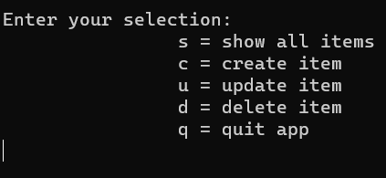

# ADO.NET DataTable , DataColumn , DataRow practice

* https://learn.microsoft.com/en-us/dotnet/api/system.data

1. use System.Data namespace
2. Create TodosDB class that enable CRUD operation on Items data collection 
	with GetAllItems,UpdateItem,InsertItem,DeleteItem methods using DataTable , DataColumn , DataRow classes
3. Create UI that uses TodosDB CRUD methods to enable the user interacting with Items data collection 

* For example ,user interface:

