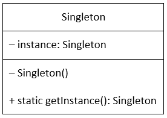

# Singleton

The Singleton Design Pattern is a Creational pattern, whose objective is to create only one instance of a class and to provide only one global access point to that object.

Singletons are often preferred to global /static variables because:
1. Enables control of object creation, limiting the number of objects to only one. The singleton allows only one entry point to create the new instance of the class.
2. Can implement interfaces, can inherit from other classes
3. Can be initialized lazily or asynchronously and loaded automatically by the .NET Framework CLR (common language runtime) when the program or namespace containing the class is loaded. While a static class is generally initialized when it is first loaded and it will lead to potential class loader issues.
4. Static class allows only static methods and you cannot pass static class as parameter

https://www.c-sharpcorner.com/UploadFile/8911c4/singleton-design-pattern-in-C-Sharp/

https://www.freecodecamp.org/news/the-basic-design-patterns-all-developers-need-to-know/